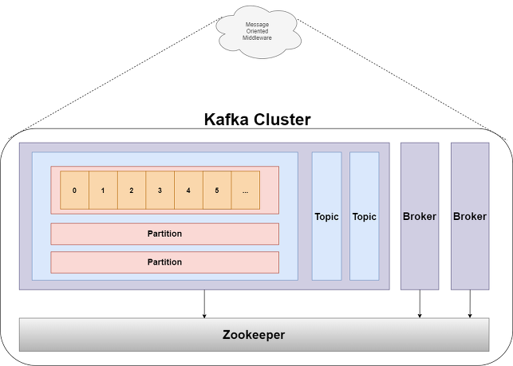
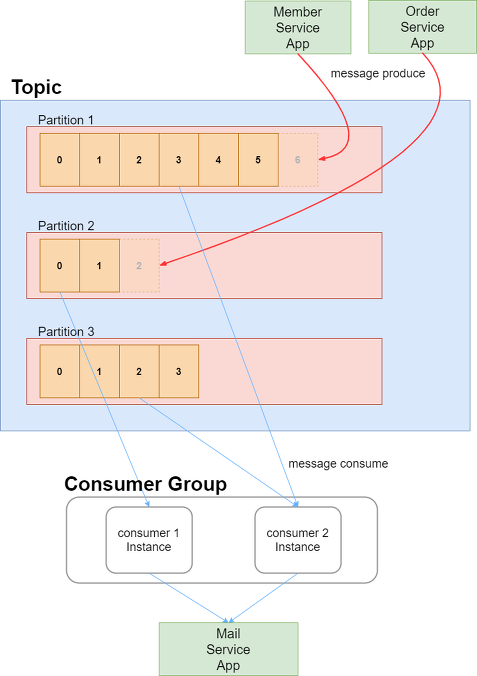
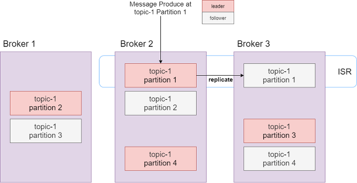

# Kafka

메세지 브로커로 아주 많이 쓰이는 `kafka` 에 대해서 알아보자 💌  

## 목차
- [Kafka](#kafka)
  - [목차](#목차)
  - [아키텍처](#아키텍처)
  - [Partition의 메세지 기록 방법](#partition의-메세지-기록-방법)
  - [Replication](#replication)
  - [알아야될 정보들](#알아야될-정보들)
  - [참고 자료](#참고-자료)

## 아키텍처

<div>
    
</div>

전체적인 구성요소는 이렇게 되는데요  
하나씩 천천히 파헤쳐볼까요?  

* ZooKeeper: 원래의 용도는 `Cluster` 들의 설정 정보 관리, 동기화 등 클러스터 서버들이 공유하는 데이터를 관리하기 위해 사용
  * 즉, Message Broker들의 `Cluster` 들을 관리하는 친구라고 보면 된다 (이 친구 없이 Kafka는 구동할 수 없다)
* Broker: Kafka Server를 지칭하며 한 Cluster 내에 여러 Broker를 띄울 수 있다
* Topic: 메세지가 생산되고 소비되는 주체
* Partition: 하나의 `Topic` 내에서 메세지가 분산되어 저장되는 단위
  * 만약, 3개의 Partition이 있다면 3개로 분할되어 메세지가 저장되는 것이죠
  * 다만 `Partition` 내부는 `Queue`로 되어 있어서 순서를 보장하지만, Partition 끼리는 순서를 보장하지 않는다
* Log: `Partition`의 한 칸을 지칭한다
  * 구성요소로는 **key, value, timestamp** 로 구성되어 있다
* Offset: Partition의 각 메세지를 식별할 수 있는 unique 한 값

정말 많은 친구들이 있지만,  
각각의 구성요소들이 하나의 책임을 가지고 이루어진 모습을 볼 수 있어요

## Partition의 메세지 기록 방법

그렇다면 가장 궁금한 사항인 각각의 `Partition` 은 어떻게 메세지를 기록할까요?  

<div>
    
</div>

각각의 `Partition`은 Queue 구조로 있다고 말씀드렸는데요  
어떤 Partition에 메세지가 들어가고 나올까요?  

바로 2가지 구성요소가 있습니다  
* Producer: 메세지를 Partition에 넣어주는 메세지 제공자
  * `Partition`이 여러개 있으면 기록될 `Partition`은 **Round-Robin** 방식을 택합니다
  * 그리고 queue 구조이므로 마지막 **offset** 뒤에 메세지를 기록하게 됩니다
* Consumer Group: 하나의 Topic을 담당해서 메세지를 꺼내오는 친구
  * `Topic`은 여러개의 `Cosumer Group`에 접근할 수 있지만, 하나의 `Consumer Group` 은 하나의 `Topic` 에만 접근할 수 있다

`Producer` 는 하나 단위로 하는데, `Consumer`는 왜 그룹단위일까요?

1. Partition에 접근하는 Consumer를 관리해야 되기 때문입니다
2. offset을 공유해서 고가용성을 확보하기 위함입니다

만일 여러개의 `Consumer`가 하나의 `Partition`을 동시에 consuming 한다면  
어떤 offset에 해당하는 message를 consuming 해야될지 모르기 때문입니다.  
즉, Consumer Group을 통해서 하나의 Partition에 대해 하나의 Consumer만 붙도록 하게 되는 것이죠 :)  
그리고, 특정 `Consumer`가 Consuming 하다가 에러가 발생한 경우 다른 `Consumer`가 와서 동일한 **offset** 으로 consuming 할 수 있게 되는 것이죠!  

<br>

아하, 그러면 우리는 `kafka` 를 구성하는데에 있어서 제일 중요한 것은 바로  
**kafak의 partition의 개수와 consumer Group에 해당하는 consumer 수**를 조정하는 것이 제일 중요한 사항임을 알게 되었습니다  

```text
왜냐하면, 동일한 consumer group이라면 
하나의 partition에는 하나의 consumer만 붙을 수 있기 때문이죠
그래서 제일 이상적인 상황은 
partition 개수 : consumer 인스턴스 개수 = 1 : 1
일 것입니다.
```

그래서 일반적인 상황으로는  
`Partiton개수 >= Consumer 인스턴스 개수` 로 설정하는 것이 좋겠죠?  
> 꿀팁, Kafka는 Partition의 개수를 늘릴 수는 있지만, 줄일 수는 없습니다

## Replication

`Replication` 은 Topic에 대해서 복제본을 생성할 수 있는 옵션입니다  
어떻게 주면 되냐면요.. `--replication-factor` 옵션을 지정하면 됩니다!  

`Replication` 이란 `Zookeeper` 가 `leader` 되는 Partition을 정하고,  
Partition을 각 broker 마다 복제를 하는 것입니다  
이때 `leader`를 복제하는 partition 을 `follower` 라고 합니다  

* leader: 메세지가 실제로 생산되고 소비되는 broker
* follower: 그저 leader을 복제하기만 합니다

만일 `leader` 가 장애가 나서 죽어도? 다른 `folllower` 중의 하나가 leader가 되는 것이죠  

<div>
    
</div>

위의 예시는 `--replication-factor` 를 2 로 지정한 예제입니다  
각각의 partition들이 2개씩 골고루 있는 것을 볼 수 있죠!  

## 알아야될 정보들

기본적으로 kafka의 `message` 보관 기간 정책은 7일이며  
`log.retention.hours` 설정을 통해서 수정할 수 있습니다  
또한, `Consumer`가 메세지를 소비한다고 해서 메모리에서 사라지는 것이 아니라  
위 `보관 기간` 이 지나야 정상적으로 삭제하게 됩니다 :)  

그래서 이미 `consume`한 메세지에 대해서도 **offset** 조정만 한다면  
다시 `consuming` 이 가능한 것이죠!  


## 참고 자료

- [kafka 기본 개념잡기](https://victorydntmd.tistory.com/344)
- [kafka cosumer group에 대해서](https://www.popit.kr/kafka-consumer-group/)